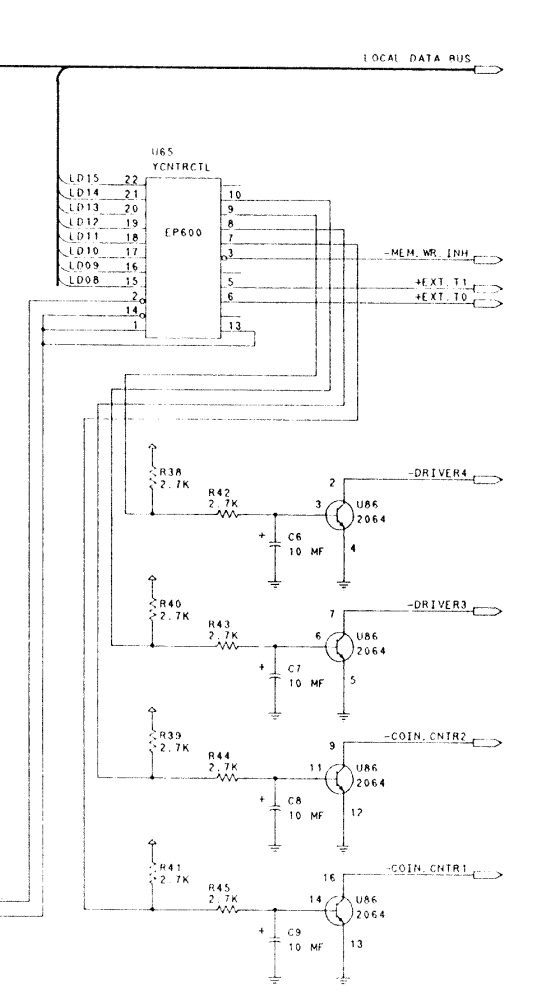

# **Williams / Midway Y-Unit Hardware Overview**

### CVSD Sound Board Variant:
<table>
  <tr>
    <td align="center">
      
      <br>
      <b>Smash TV</b><br>
      <i>(16-3044-K-101)</i>
    </td>
    <td align="center">
      
      <br>
      <b>Trog</b><br>
      <i>(16-40003A-101)</i>
    </td>
    <td align="center">
      
      <br>
      <b>High Impact</b><br>
      <i>(16-40104-101)</i>
    </td>
  </tr>
  <tr>
    <td align="center">
      <br>
      <b>Strike Force</b><br>
      <i>(16-42413-101)</i>
    </td>
    <td align="center">
      
      <br>
      <b>Super High Impact</b><br>
      <i>(16-43117-101)</i>
    </td>
  </tr>
</table>

### ADPCM Sound Board Variant:
<table>
    <td align="center" style="padding: 10px;">
      
      <br>
      <b>T2: Judgment Day</b><br>
      <i>(16-40009-101)</i>
    </td>
    <td align="center" style="padding: 10px;">
      
      <br>
      <b>Total Carnage</b><br>
      <i>(16-40010-101)</i>
    </td>
    <td align="center" style="padding: 10px;">
      
      <br>
      <b>Mortal Kombat</b><br>
      <i>(16-43125-101)</i>
    </td>
  </tr>
</table>

## Document Links

- [Y-Unit Hardware Overview (*this document*)](/Midway/Y-Unit/midway_yunit.md)
  - [Y-Unit Service Manuals](/Midway/Y-Unit/public_documents)
    - [Smash TV Service Manual and Schematic](/Midway/Y-Unit/public_documents/1990_09_XX_Smash_TV_16-3044-K-101.pdf)
    - [Trog Service Manual and Schematic](/Midway/Y-Unit/public_documents/1990_09_XX_Trog_16-40003A-101.pdf)
    - [High Impact Football Service Manual and Schematic](/Midway/Y-Unit/public_documents/1990_12_XX_High_Impact_Football_16-40104-101.pdf)
    - [Strike Force Service Manual and Schematic](/Midway/Y-Unit/public_documents/1991_02_XX_Strike_Force_16-42413-101.pdf)
    - [Super High Impact Football Service Manual and Schematic](/Midway/Y-Unit/public_documents/1991_09_XX_Super_High_Impact_16-43117-101.pdf)
    - [Terminator 2: Judgement Day Service Manual and Schematic](/Midway/Y-Unit/public_documents/1991_12_XX_T2_Judgement_Day_16-40009-101-1.pdf)
    - [Total Carnage Service Manual and Schematic](/Midway/Y-Unit/public_documents/1992_01_XX_Total_Carnage_16-40010-101.pdf)
    - [Mortal Kombat Service Manual and Schematic](/Midway/Y-Unit/public_documents/1992_08_XX_Mortal_Kombat_16-43125-101.pdf)
  
## **Introduction**
This document is a select overview of the WIlliams / Midway Y-Unit System. Before reading this, please see the Z-Unit documentation, as a lot of it is similar and shares the same design principles and components. Think of the Y-Unit as an evolved and optimized Z-Unit system. This document will cover largely the differences between the Z-Unit and Y-Unit hardware.

### **Disclaimer:**
The materials provided on this site are licensed under the [Creative Commons Attribution-NonCommercial-ShareAlike 4.0 International License](https://creativecommons.org/licenses/by-nc-sa/4.0/). You are free to share, copy, redistribute, remix, transform, and build upon the material, provided that appropriate credit is given to [Coin-Op Collection](https://github.com/Coin-OpCollection), including a link to the source and license, and an indication of any changes made. Attribution must be presented in a reasonable manner that does not imply endorsement by the licensor.

The materials may not be used for commercial purposes, and any adaptations or derivatives must be distributed under the same license as the original. If you wish to use the content in a way that falls outside these terms or have any questions, please contact us directly. Unauthorized use, such as creating derivative works like YouTube videos or posts without proper attribution or linking back to the source, is not permitted.

## **High Level Architecture**
In the Z-Unit architecture, there was a total of 4 boards: Main CPU, I/O, Sound and Image ROM. However, in the Y-Unit, there are only 2 boards:

- Main CPU
- Sound

In the Main CPU board, they consolidated I/O, ROM and CPU in one. The sound board still communicates and has an interface with the Main CPU board via a "talkback" interface ribbon cable, however. In total, there are 8 games that the Y-Unit platform supports listed below.

#### CVSD (Continuous Variable Slope Delta-Modulator) Titles:
  - Smash TV
  - Trog
  - High Impact Football
  - Strike Force
  - Super High Impact Football
#### ADPCM (Adaptive Differential Pulse-Code Modulation) Titles:
  - Terminator 2: Judgement Day
  - Total Carnage
  - Mortal Kombat

All these games are different from each other from a board perspective, and so none of them can really be converted to one another.

Like it's predecessor, the Y-Unit is really an extremely high performance memory mover. All the graphics and effects are achieved by moving data at high speed between the Image Data ROM / Memory to VRAM. So, similar to the Z-Unit, this system also needs a very high throughput memory wise in order to be able to be functional.

### **Component Similarites with the Z-Unit**
The Y-Unit operates on the same CPU as the Z-Unit: Texas Instruments' TMS34010 Chip. As mentioned in the Z-Unit document, the CPU also has a GPU (actually widely regarded as the first commercial "GPU" in existence). 

However, Williams / Midway did not actually use the GPU in the TMS34010 for much except the POST screens. In the Analogue Pocket Core, the GPU has been eliminated because it took up too much LE. I will revive this when MARS and future next-generation FPGA platforms release.

The same DMA Custom Chip is used in the Y-Unit to draw graphics and also to act as an interface to the Image Data ROM. I have documented this in the Z-Unit document.

### **Differences with the Z-Unit**
The Y-Unit is largely the same as the Z-Unit from an architectural standpoint except it consolidates much of the components in a single board, save for sound. There are, however, a number of differences in the Y-Unit functionally speaking.

#### **Protection**
Midway introduced a protection IC as apart of most of the Y Unit boards. All of the Y-Unit boards have a protection IC except Smash TV and Strike Force (*see below*).

If the protection chip is invalid on the board, a black screen occurs and the game doesn't display anything when turned on. In Total Carnage, weird things seem to happen if the protection chip is not valid. Controls seem to be messed up and a black screen occurs at some point, though not at the very beginning like the other boards.

Strike Force emulates the protection IC, though does not have a legit protection IC on board. It is a dynamic, memory-based protection scheme. It is the same scheme as the protection IC, but the data that would normally be read from the protection IC is redirected to the scratch (main) RAM instead. The keys are not static either, they are dynamically generated by the program every time, so it's a bit more advanced than just the IC protection. I don't actually have the Strike Force board though to confirm this, but from the schematics it seems like the U65 "YCNTRCTL" is on there, but then again, I don't know why it wouldn't be used in the same scheme like the other games. Mabe it is used partially in some way, because the keys definitely come dynamically from the program and from main RAM.

Below, is a local schematic from Total Carnage concerning the U65:


As you can see, it is connected to the upper 8 bits on the address bus, meaning, the lower 8 bits will be 00 when the data is reported to the CPU. This chip is also used as a Coin Counter Control as you can see from the outputs and inputs. So, protection is implemented through the coin counter IC.

##### **How the Protection Chip Works**
Reading the key from the protection IC is a multi-cycle operation. Below are the sequence of steps that are used to read from the IC by the program:

- A write request is made on the address bus to 0x1C00060.
- The module notes the value.
- This same thing happens 2 more times.
- After buffering a sequence of 3 consecutive values for a write operation, the program issues a read request to 0x1C00060.
- A byte of the key is returned to the program, and the key index counter is incremented by 1.
- The above sequence repeats until the 3 consecutive values equals a "reset" sequence.
- The "reset" sequence resets the index of the read to 0.

So, in other words, it is similar to reading from an EEPROM chip in a multi cycle way.

#### **Effective Resolution & Graphics**
The resolution of the Z-Unit (NARC) called for a medium res monitor and operated at 512x400 at 8bpp. It had a 16Mhz pixel clock. However, the Y-Unit operated at a standard resolution monitor at 15khz, and the resolution was about 400x256 at 6bpp. Some games vary a little bit from this, but generally it is one to four pixels off. It has an 8Mhz pixel clock.

##### **Image ROM Decoding**
The Z-Unit Image ROM board served the graphics quad-banked and assembled in a 32 bit sequence. All that really needed to be done was byteswapping the Image Data due to the endianness of the original data format.

The Y-Unit, however, uses 6bpp, and so the way the graphics format is requires that the data be rearranged into a compliant 8 bit format. There are a couple of games (Strike Force and Trog) that have 4bpp graphics, and they too need to be padded out so that they can be rearranged using the same 6bpp scheme, which effectively rearranges the data in an 8 bit scheme. The padding and alignment of the data was a challenge to work out originally. Especially Trog and Strike Force is not straightforward to rearrange in a contiguous format.

Below is how I reorder the data coming in from the Image ROM to be compliant for 32 bit DMA to accept it:
```
BIT_DEPTH == 6 ? {2'b00, gfx32_dout[23:22], gfx32_dout[7:6], gfx32_dout[15:14], 2'b00, gfx32_dout[21:20], gfx32_dout[5:4], gfx32_dout[13:12], 2'b00, gfx32_dout[19:18], gfx32_dout[3:2], gfx32_dout[11:10], 2'b00, gfx32_dout[17:16], gfx32_dout[1:0], gfx32_dout[9:8]} :

BIT_DEPTH == 4 ? {2'b00, 2'b00, gfx32_dout[7:6], gfx32_dout[15:14], 2'b00, 2'b00, gfx32_dout[5:4], gfx32_dout[13:12], 2'b00, 2'b00, gfx32_dout[3:2], gfx32_dout[11:10], 2'b00, 2'b00, gfx32_dout[1:0], gfx32_dout[9:8]} :

gfx32_dout;
```

This rearrangement is done live, so no precomputation or pre-arrangement is necessary on the loader side. Below is a mapping that is easier to follow for the bits:

|Bit No. of Payload|Target Arrangement Bit No. in 6bpp|Target Arrangement Bit No. in 4bpp|
|------------------|----------------------------------|----------------------------------|
|0|2|2|
|1|3|3|
|2|10|10|
|3|11|11|
|4|18|18|
|5|19|19|
|6|26|26|
|7|27|27|
|8|0|0|
|9|1|1|
|10|8|8|
|11|9|9|
|12|16|16|
|13|17|17|
|14|24|24|
|15|25|25|
|16|4|-|
|17|5|-|
|18|12|-|
|19|13|-|
|20|20|-|
|21|21|-|
|22|28|-|
|23|29|-|
|24|-|-|
|25|-|-|
|26|-|-|
|27|-|-|
|28|-|-|
|29|-|-|
|30|-|-|
|31|-|-|

So, as you can see from the above mapping chart, the 4bpp does in fact follow the 6bpp decoding and arrangement scheme, however, some bits are not used as the data is 4bpp instead of 6bpp. The '-' indicates no usage in the target format (ie. blank, 0 placeholder).

#### **Autoerase PLD or Bulk Clearing**
The Autoerase PLD, which I described in the Z-Unit document, is present on most of the boards in the Y-Unit except for Strike Force and Terminator 2. The two games that do not have it, instead opt to use the bulk clearing functionality on the GPU side of the TMS34010 in order to clear lines after they are output to the CRT.

Originally, I eliminated the entire GPU from the Analogue Pocket Core and did not plan for any game to use any of the functionality legitimately. However, late in the course of development, I found that my code was not working for Strike Force and Terminator 2. Both games had problems and / or did not start correctly after the POST screens.

After some research, I found that both games do not have an Autoerase PLD and instead use the bulk clearing functionality of the CPU. To do this, the program issues a FILL instruction command with the shift register transfer flag (TRn) on. The clearing request is transferred to the memory controller and subsequently done by sending the command to the memory chip itself, where it does it under the function of the shift memory buffers embedded in the chip controller.

From an FPGA perspective, this is challenging to do, in a similar way to the Autoerase PLD as I mentioned in the Z-Unit.

##### **Shift Buffer Operation**
The shift buffer operation is a thing that exists inside the memory chip controller itself. What happens is you can tell the memory chip controller that fronts the memory chip to load the buffer with the contents of a block of contiguous memory. So, for example, I can specify a starting address of the block, and it will load the shift buffer with 2048 bytes of data starting from that address.

This functionality was used in NARC only for the high score screen, as I have mentioned in other posts. Specifically, it is used in conjunction with vertical scrolling of the screen - 2 lines are copied in and back out again to the next lines as the screen scrolls up.

However, in the Strike Force and Terminator 2 games, this functionality is used as apart of autoerasure. The memory controller is directed to copy the last 2 lines of VRAM into the shift buffer. These last 2 lines are pre-loaded by DMA with an autoerase value to designate a cleared pixel with (even and odd lines). For the duration of the frame, the lines that were copied into the shift buffer are used to erase lines in VRAM through the same mechanism, under the guidance of the CPU. Each time the CPU issues a FILL command with the TR flag on, and operation in write mode, the contents of the memory are overwritten with the contents of the shift buffer.

The shift buffer operation only covers 2 lines at a time, however, at the front memory controller level. The memory controller of the CPU internally manages multiple subsequent requests until the entire bulk clear operation is fulfilled. The length and parameters of the clear are specified by registers DADDR, DYDX and OFFSET which are in the B register file in the CPU.

So, that covers how the command request arrives and is interpreted. The execution of this, is similar to the Autoerase PLD functionality I have implemented - also by statistical inference. The entire operation avoids writing to SDRAM entirely to save bandwidth for other critical VRAM operations. The bulk fill is disabled for games outside this particular use, as it could collide with other ways those games are using shift register transfers.

##### **Autoerase PLD vs. Bulk Clearing**
So, there are a couple of games which do not have the special Autoerase PLD component, but why is that, and what are the pros and cons of both approaches?

First of all, let's take a look at the Autoerase PLD. The functionality of the PLD will be invoked in accordance with a line counter automatically following the output of a line to the CRT. It locks out every other device from accessing the VRAM, and it will perform a clear of 1 line.

This approach is suitable if you do not want to spend resources in the game managing and timing out a clear operation. Just simply do whatever it is you want to do in the game loop, and it should be fine. There is no need to have any special logic for clearing aside from loading clear values via a DMA operation at the start of the frame (as has to be done anyway, no matter what approach).

However, this approach might introduce performance issues in the game. You need to account for a fixed block of time at the blanking interval which cannot be used for any other purpose other than clearing the previous line. Also, you of course need to spend money on yet another custom chip and route that on the board whose sole purpose is to clear lines. There's a cost / trade benefit here.

This brings us to the second approach - the bulk clearing via FILL. This method is native in the CPU, so no additional components need to be introduced on the board. It is extremely fast when used correctly too. It is managed under the guidance of the game program, so you are not caught off-guard performance wise by the fixed time needed by the Autoerase PLD. You can do the clearing when and where you want, and for the duration you want, every time, every frame. Or, mabe even never for that frame if you wanted to. although, for the Autoerase PLD, you could turn it on and off too via flag for certain lines.

The con of this approach is that now you need to plan out your game cycles more carefully and account for clearing time if you need it. So, you gain more control, but sacrifice simplicity in the planning of the game. But, if your game requires high performance anyway for what it does, this might be a good move, and that's why they did it for Terminator and Strike Force. There's a lot of stuff going on in the screen for both games.

#### **Sound**
The Z-Unit NARC sound board was a CVSD based board. The Y-Unit has 2 sound boards, one that is CVSD based that is a simplified version of the NARC sound board, and an ADPCM based sound board.

The ADPCM based board is used by 3 games: Terminator 2, Total Carnage and Mortal Kombat. The CVSD is used for the rest.

##### **CVSD Sound Board**


In the NARC sound board there were 2 6809 processors. One was for speech and the other was for FM sounds and music. In this CVSD Sound board, there is only 1 6809, and it is used for both speech and FM sounds.

There is still a YM2151 and it's associated DAC, as well as an HC55536 CVSD module. There is the same additional DAC as well connected to it which is used to make the BONG sounds on the POST screen.

Implementation wise, I consider this board to be the hardest of the 3 sound boards in the Y and Z-Unit. There is one very annoying thing about this design in that it uses a PIA (Peripheral Interface Adapter) chip to do all the interfacing between sound board components. It just works in a weird way, that's the best I can describe it. Other than that, this CVSD module is fairly straightforward to program in the FPGA by following the schematic. There isn't anything fancy going on in this board that warrants complexity.

##### **ADPCM Sound Board**
[TODO: ADPCM Sound Board Schematic]

The ADPCM Sound board is probably the easiest of the sound boards to implement. It uses 1 6809 as well, and uses direct interfacing to the components rather than using a middleman PIA. It also has the same BONG DAC, YM2151 and for the ADPCM speech, an MSM6295 OKI.

Again, nothing really special about this from an implementation perspective, it is pretty straightforward and standard at that.

[TODO: BOMs and component information for all boards]

## License

The documentation provided on this site is licensed under the [Creative Commons Attribution-NonCommercial-ShareAlike 4.0 International License](https://creativecommons.org/licenses/by-nc-sa/4.0/). 

This means you are free to:

- **Share**: Copy and redistribute the material in any medium or format.
- **Adapt**: Remix, transform, and build upon the material.

However, the following terms apply:

- **Attribution**: You must give appropriate credit to [Coin-Op Collection](https://github.com/Coin-OpCollection), provide a link to the license, and indicate if changes were made. You may do so in any reasonable manner, but not in any way that suggests the licensor endorses you or your use.
- **Non-Commercial**: You may not use the material for commercial purposes.
- **ShareAlike**: If you remix, transform, or build upon the material, you must distribute your contributions under the same license as the original.

For any exceptions or further inquiries, please contact Coin-Op Collection directly.