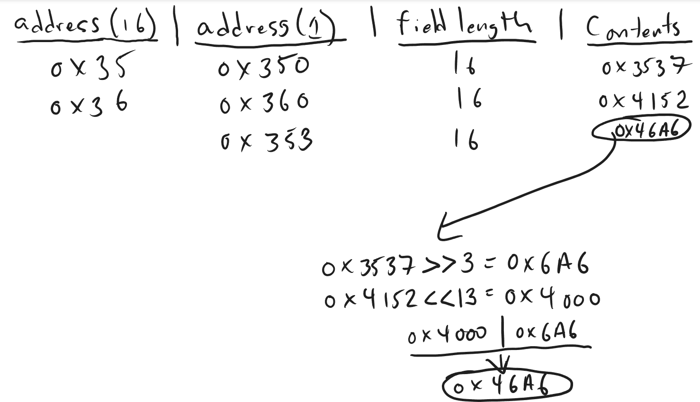

# **Midway Z-Unit**
## **Introduction**
This document is a schematics-based overview of the Midway Z-Unit System, which is supported by images scanned by myself from the NARC service manual. In this overview, you will see sections of the schematics presented alongside technical information and implementation details from the Midway Z-Unit Core for the Analogue Pocket we have released.

### **Legal Mumbo-Jumbo**
Unfortunately, with the way everything has become now at days, I have to state that it is perfectly OK to link to this site and use materials from it ONLY if proper attribution is made. If you want to do something else with it and have any doubts, please contact us and we can answer. But please, do not be like certain people and just randomly create YouTube videos and posts without proper attribution, and always link back to the source.

## **High Level Architecture**

The Z-Unit architecture is composed totally of 4 boards.
- Main, CPU Board
- Image/ ROM Board
- I/O Board
- Sound Board

All of these boards must be connected to eachother in a specific way, as outlined by the diagram above. Therefore, the most practical way to connect the system in a cabinet or home scenario is to have a mounting board and lay out all the pieces as shown. Then, connect the ribbon cables and also the power supply/ transformer to the side.

As it is very difficult to do this, and I might be missing some of the interface cables, during development, I did not hook up the board and observe it normally as I usually do as it was impractical for me to do so. I physically inspected the boards and reviewed certain parts as development commenced, but did not go through the expense of actually hooking things up. The transformer/ power supply I have does not support NARC as it needs enough power to power all the boards.

### **Main CPU Board**

#### **Bill of Materials**
|   Item No. | Part No.      | Part Description   | Description                 |   Qty |
|-----------:|:--------------|:-------------------|:----------------------------|------:|
|         15 | 5880-11056-00 | B1                 | Battery - Lithium 3V Button |     1 |
|         14 | A-5346-3036-7 | U28                | IC, PLD-COLOR RAM CNTL      |     1 |
|         13 | A-5346-3036-6 | U78                | IC, PLD-LOCAL CONTROL       |     1 |
|         12 | A-5346-3036-5 | U79                | IC, PLD-VIDEO RAM CNTL      |     1 |
|         11 | A-5346-3036-4 | U80                | IC, PLD-ADDRESS DECODE      |     1 |
|         10 | A-5346-3036-3 | U83                | IC, PLD-IMAGE ROM CNTL      |     1 |
|          9 | A-5346-3036-2 | U12                | IC, PLD-VIDEO RAM SEQ.      |     1 |
|          8 | A-5346-3036-1 | U20                | IC, PLD-AUTOERASE CNTL      |     1 |
|          7 | 5340-12019-00 | U65                | IC, RAM/S 5564 8K x 8       |     1 |
|          6 | 5340-12213-00 | U42-U49            | IC, RAM/V 4464 64K x 4      |    16 |
|          4 | 5400-12220-00 | U18                | IC, TMS34010 GSP            |     1 |
|          3 | 5410-12239-00 | U77                | IC, CUSTOM ASIC (DMA)       |     1 |
|          2 | 16-8850-210   | LABEL              | PCB IDENT.                  |     1 |
|          1 | C-11878       | SYS-Z              | CPU PCB SUB-ASSEMBLY        |     1 |

The above is a BOM which is listed in the manual. It indicates the major components on the CPU Board C-11879-3036. Below, I will go over some of the major components and what role they play in the FPGA Core and system.

#### **U18, TMS34010 GSP/ CPU**
This is the main CPU of the system, the [Texas Instruments TMS34010 CPU](https://en.wikipedia.org/wiki/TMS34010). The CPU was a powerhouse at the time this game was released, and Midway also used it in subsequent games on the Y, T and Wolf Units. Additionally, this CPU is not to be confused with the TMS34020, which was released later, functions a little bit differently, and is more suited towards 3D operations practically speaking.

As it indicates in the Wikipedia article, the chip was both a CPU and GPU. The CPU includes instructions for moving data, mathematics and other functional operations. The GPU side includes instructions for drawing data in VRAM, and bulk clearing. In addition, the chip also could generate sync and blank video signals, or, optionally, sync with an external video circuit that would do the same. It could also operate in interleaved and progressive mode.

From a development perspective, it took about 1 year total to implement the chip. I redesigned it and rewrote it multiple times for the MiSTer, and then rewrote it again for the Analogue Pocket. I have implemented the CPU and GPU parts totally. For the Analogue Pocket, I have eliminated the GPU as it is not used in games except for the POST screens and some diagnostic messages that are outside of the normal gameplay loop. I eliminated the GPU from the Analogue Pocket to get the CPU to fit in the smaller FPGA unit.

Other than replicating the functionality from the developer's guide published by TI directly, I have also used current emulator sources to test issues and adjudicate when the manual was unclear. As in the original design, the instruction executions were implemented with a custom microcode engine I designed. The GPU did not use microcode, and so I implemented that using standard verilog. I have only ever tested proper workings on the MiSTer, and intend to reintroduce the GPU back in the implementation for MARS as it has the space. The FPGA implementation has the CPU generating the video line counter and interesting to note, the video timings come from the game program, so there is no need to actually setup static video timings via measurement like we would normally do on other cores or systems.

#### **U77, DMA**
The DMA Chip is a very important chip in the system that handles all bitmap rendering. The DMA has a direct line to the Image/ ROM Board. It also has a direct line to the Bitmap and Palette RAM. Again, the graphics are not rendered by the CPU even though the CPU could technically do it. The reason why is because the CPU bus is too small. It can only take in and output 16 bits. That's not enough to power the requirements of the system, so they needed something that operated on a 32 bit bus.

In the games, there is a concept of "software sprites" and "software backgrounds". All the layering, object management and queues are managed by game software. DMA is simply responsible for pulling data from the ROM, and plotting it according to commands (also called modes) that are sent to it which describe the ways of processing the ROM Image Data before getting output to the Bitmap and Palette RAM. Normally, in other systems of the period, many had hardware sprites and graphics that would normally work by a custom chip.

#### **U20, Autoerase PLD**
The Autoerase PLD performs a very simple, but important function in the system and it exists in the Z and Y Units on most games. Pixel data goes from either the CPU or DMA to Bitmap and Palette RAM. Following that, there are line counters that run and determine what lines to output to the CRT. After the lines get pulled from Bitmap and Palette RAM to the line buffer and then eventually get read out to the CRT, there is a process for clearing the line that got outputted from the source memory to set the stage for the next frame - that's where the Autoerase PLD comes in.

The Autoerase PLD gets automatically invoked following a line output to the CRT. While it does its work, it acts as the complete bus master and locks out everything else from accessing the RAMs it touches (including the CPU). It is a very high priority to clear the line in memory to set the stage for the next frame.

It is interesting to note that although no games really take advantage or use it, the last 2 lines of the Bitmap and Palette RAM are intended to provide a value to clear the lines with. Usually all these values are the exact same values, but technically a game could write different values in each of the pixel positions, and it should be cleared with that line pattern.

#### **U78, Local Control PLD & U80, Address Decoder PLD**
These two chips provide control mechanisms for accessing devices external to CPU on the bus. For example, it handles addressing of I/O, ROMs and RAMs.

#### **U28, Color RAM Control PLD & U79, Video RAM Control PLD**
The local control and address decoder handle arbitration to individual devices on the bus, and the Color RAM and Video RAM controllers handle access to their respective ColRAM and VRAM components.

It is important to note that sometimes we use the term "Palette RAM" to refer to the part of the memory that holds the Palettes which are used to determine the colors outputted to the screen. However, in this system, that's a different thing. The Palette RAM is the upper part of a pixel. The lower part is called Bitmap RAM. Both are apart of Video RAM.

Color RAM, is really referring to the source of the data where the master palette entries and reference are located.

#### **B1, Lithium 3V Battery, for CMOS**
All settings for the game persist in CMOS RAM. In order to do this, nonvolatile memory is kept alive by a Lithium Battery while the system does not have power to it. This is common in most computer motherboards now at days, and even back then for the BIOS. The FPGA Core of course saves CMOS RAM, persisting it on the SD Card, and loads it back up when the core is started.

### Image/ ROM Board

#### Bill of Materials
|   Item No. | Part No.      | Part Description   | Description                 |   Qty |
|-----------:|:--------------|:-------------------|:----------------------------|------:|
|          3 | 3036*         | U23-U94            | GAME ROM SET                |    72 |
|          2 | 16-8850-219   | LABEL              | PCB IDENT.                  |     1 |
|          1 | C-12261       | SYS-Z              | ROM 2 SUB-ASSEMBLY          |     1 |

#### **U23-U94, Image ROM Data**
The entire board contains the Image ROM Data for the game. That is, the bitmap data that has the sprites, backgrounds, objects, etc. This has a 32 bit and 16 bit interface to it's respective connected components. The 32 bit interface is for the DMA Chip, and the 16 bit interface is for the CPU. Whenever possible and practical, the CPU too gets involved in pulling data from the Image ROM and using that either for collision detection, plotting pixels, or other sorts of operations.

### **I/O Board**

#### **Bill of Materials**
|   Item No. | Part No.      | Part Description             | Description                                |   Qty |
|-----------:|:--------------|:-----------------------------|:-------------------------------------------|------:|
|         15 | 16-8850-212   | LABEL                        | PCB IDENT.                                 |     1 |
|         14 | 5792-10026-00 | P4                           | CONNECTOR, 64P EURO-DIN CARD CONN., FEMALE |     1 |
|         13 | 5791-10862-10 | J5, J3, J4, J5, J6           | CONNECTOR, 10P MOLEX .156" CENTER PINS     |     5 |
|         12 | 5791-10862-04 | J1                           | CONNECTOR, 4P MOLEX, .156" CENTER PINS     |     1 |
|         11 | 5043-09845-00 | C2, C3                       | CAPACITOR, .001 MFD.                       |     2 |
|         10 | 5040-08986-00 | C1                           | CAPACITOR, 100 MFD.                        |     1 |
|          9 | 5043-08980-00 | B                            | CAPACITOR, 0.01 MFD.                       |     9 |
|          8 | 5010-08991-00 | R1                           | RESISTOR, 4.7K, 1/4W, 5%                   |     1 |
|          7 | 5060-10396-00 | SCR1, SCR2, SCR3, SRC4, SRC5 | SIP, 10P 8-RES/8-CAP NETWORK, 4.7K, 470 PF |     5 |
|          6 | 5551-09822-00 | L1                           | INDUCTOR, 4.7 UH                           |     1 |
|          5 | 5311-10948-00 | U9                           | 74HC138, H-CMOS, 3/8 DECODER               |     1 |
|          4 | 5311-12208-00 | U7, U8                       | 74ALS245, ALS TTL, OCTAL BUS TRANSCEIVER   |     2 |
|          3 | 5311-10945-00 | U6                           | 74HC32, H-CMOS, QUAD 2-INPUT OR GATE       |     1 |
|          2 | 5311-12287-00 | U1, U2, U3, U4, U5           | 74HC541, HC TTL, OCTAL BUFFER              |     5 |
|          2 | 5779-12265-00 |                              | BARE PC BOARD                              |     1 |

Nothing special with this, all this board does is handle the input interface for player 1 and 2.

### **Sound Board**

#### **Bill of Materials**
| Item No. | Part No.      | Part Designation               | Description                     | Qty |
|----------|---------------|--------------------------------|---------------------------------|-----|
| 7        | 3036*         | U3, U4, U5, U35, U38, U37, U36 | 27512/1001 EPROM 250 NS         | 7   |
| 6        | 5371-11087-00 | U8                             | YM3012 DUAL SERIAL DAC          | 1   |
| 5        | 5370-11088-00 | U7                             | YM2151 SOUND GENERATOR          | 1   |
| 4        | 5340-12278-00 | U2, U34                        | 8K X 8 STATIC RAM, 150NS        | 2   |
| 3        | 5400-10320-00 | U1, U33                        | 68B09E MICROPROCESSOR           | 2   |
| 2        | 18-8850-230   | LABEL                          | PCB IDENT.                      | 1   |
| 1        | C-12350       | SYS-Z                          | SOUND BOARD SUB-ASSY            | 1   |

#### **U3, U4, U5, U35, U38, U37, U36, Sound ROMs**
The game has multiple sets of sound ROMs. One set corresponds to the master sound CPU, and one corresponds to the slave CPU.

#### **U1, U33, 68B09E Microprocessor**
The game has 2 6809 CPUs, one is considered the Master, and the other is considered the Slave. The Master is responsible for music and FM. The Slave is responsible for speech synthesis.

#### **U30, HC55536 CVSD Module**
This is not actually included on the printed BOM, but it is on the sound board. This is responsible for playback of speech by the Slave CPU.

#### **U7, U8, YM3012 & YM2151 Sound Generator & DAC**
The function of this is to play back music and FM sounds, as it normally is in other systems.

#### **U12, MC1408 DAC**
This is something else that's not on the printed BOM, but there is another DAC on the board that is responsible for some sound effects. Namely, the famous BONG noises in the VRAM Test that happens in the POST.

## **Implementation Details**

### **Interfaces to CPU**

Usually, we start our implementation with the main CPU of the system. This brings us to the first schematic below:

Let's talk about the HD* pins - that's the host data bus of the TMS34010 CPU. The host data bus of the CPU allows access to the GSP/IO registers of the CPU in an addressable way to devices outside the CPU. So, for example, let's say you had a situation where the hardware needs to write to the GSP registers from outside the CPU, it can do that from the host data bus. Another use case is if you have another CPU that is operating alongside this CPU, like a 68k or something - that would use the host data bus as an interface too to do stuff.

As you can see, in this system they are all tied down, so they are not actually used.

Next, the LAD* pins go to the local address bus. This is the primary interface of the CPU to other devices in the system. For example, if the CPU instruction requests data from the ROM or RAM, it goes through the LAD pins. Or, input devices and out to the sound board - that's the primary interface.

One more thing to note about this shot in the schematic is that you can see the video blanking signals going out from the CPU pins. It means that the CPU generates the video signals in this case. It is possible to configure the TMS with something external, but why include unnecessary video circuitry if it's already in the chip?

These next few areas in the schematic above show how the local address bus connects and gets arbitrated to various devices like RAMs and sound, etc. Usually when we do the core, we don't literally model every single possible thing as it is inefficient and takes up LE. We instead try to use these diagrams to figure out what the source and destination are, and how things get arbitrated. Then, we simplify and model that logic.

### **Interface to DMA**

This next piece in the schematic concerns DMA, how it connects into other things and what it's outputs are:

First of all, you can see that the U77 DMA chip has a line to the VRAM, labeled VIDEO ADDR BUS and VIDEO DATA BUS. It also has a line to the Image ROM Data as I have mentioned above. The RAS/ CAS lines are also indicative that this chip has a controller embedded within it to handle writes to the VRAM on its own. 

#### **Memory Controllers**

Note that the TMS34010 CPU also has embedded memory controllers to allow it to write to memory directly without the need of an additional controller. Overall in the system, there are many layers of memory controllers situated one on top of the other in the design. There are memory controllers within the CPU that allow it to perform direct memory operations while hooked up to RAM, and specialized RAM that has a shift buffer. There are also local controllers outside the CPU that get engaged in terms of arbitration to the designated memories from different sources. 

So, in the development of the core, I have had to replicate this scheme fully. There are memory controllers in the CPU that works based on bit-based addressing (the CPU is always talking in terms of 1-bit addressing, 32 bit address length). Outside the CPU, now we are talking about 16-bit addressing so there has to be something that converts that and designates it to the proper device. This is the purpose of the controllers I mentioned above while talking about the BOM earlier.

#### **16-bit addressing vs. 1-bit addressing**

By the way, for those of you who don't know, or aren't familiar with how 1-bit addressing works, I will walk you through that briefly here in this example:

Suppose you have 16-bit addressable memory chips you are trying to interface with. That is to say, each memory location contains 16 bits. You have a memory location 0x35. It contains the value 0x3537.

From a binary perspective, it looks like this:
0011 0101 0011 0111

Now, in the CPU, there's a concept of a 1-bit memory address, and a corresponding field length. The field length designates how many bits the operation should cover, and the 1-bit address should cover the starting point of the memory operation.

So, in our example above, we said the memory location 0x35 is a 16-bit memory address, and the value at that address is 0x3537. What if the CPU calls for an operation that covers just this one memory address?

The 1-bit address should be 0x350. The field length would be 16. If it is a read operation, this should return back 0x3537 to the CPU. So, the lower 4 bits of the address designate the bit pointer of the data.

Now, let's consider a more complicated and practical example. Let's suppose that the 1-bit address a read request comes from is 0x353, and the field length is 16. What this really means from the context of our 16-bit memory is:

- Take the contents of address 0x35.
- Shift the contents right by 3 bits.
- Take the contents of the next address, 0x36.
- Take the lower 3 bits, and concatenate them with the remainder of the shifted contents.
- Report this final value to the CPU.

So, there are possibilities where straddling can occur in this scheme, and you need to perform multiple reads in those cases, and concatenate the appropriate bits to return back to the CPU. This entire scheme of determining the correct field to mask or concatenate off for both reads and writes is handled by the memory controllers that layer on top of eachother in the FPGA core. This way, the CPU has a 1-bit interface to a 16-bit memory.

#### **DMA Operations and Functionality**

Now, for the DMA, It's interface to the Image Data is an 8 bit pointer (the lines in the Image Data bus are segmented into 4 8-bit parts), and it returns back 4 bytes from that pointer, which is 32 bits out.

So, that covers how DMA receives and outputs data. It requests and receives data from the Image ROM, 32 bits at a time. The command it receives via CPU contains multiple parameters under which to perform the drawing operation, and finally it writes the contents to the VRAM, which is inclusive of Palette + Bitmap RAM.

Now, let's take a look at the parameters that constitute a DMA request from the CPU, and the workflow. A DMA request is a request to draw the pixels of a specified windowed region within the screen bounds.

##### **DMA Registers**
First of all, to make a DMA request, the program puts the parameters of the request in general purpose registers, and then executes a MMTM instruction. The MMTM instruction performs a move operation of multiple specified registers to memory addresses. The destination addresses are all under the DMA device on the bus (0x1a00000 region). The data will be moved to DMA registers within the DMA device. The registers are listed below, and their function:

|Name|Address|Function|
|----------|---------------|--------------------------------|
|DMA_COMMAND | 0 | When a write occurs here, perform the operation. |
|DMA_ROWBYTES | 1 | How many bytes to increment by for each row of pixels in Image ROM.|
|DMA_OFFSETLO | 2 | The lower 16 bits of the Image ROM address for this object.|
|DMA_OFFSETHI | 3 | The upper 16 bits of the Image ROM address for this object.|
|DMA_XSTART | 4 | The starting X coordinate of the window to perform the operation at.|
|DMA_YSTART | 5 | The starting Y coordinate of the window to perform the operation at.|
|DMA_WIDTH | 6 | The width of the window.|
|DMA_HEIGHT | 7 | The height of the window.|
|DMA_PALETTE | 8 | The palette ID of the object.|
|DMA_COLOR | 9 | The static color of the object (if non-bitmap operation)|
|DMA_A | 10 | Unused.|
|DMA_B | 11 | Unused.|
|DMA_C | 12 | Unused.|
|DMA_D | 13 | Unused.|
|DMA_E | 14 | Unused.|
|DMA_F | 15 | Unused.|

Now, each of these registers are 16 bits in length, and not all of them are really used. The idea is that the game program transfers all the parameters first to the DMA chip, and then finally initiates a write to DMA_COMMAND to start it.

##### **DMA Operation Workflow**

As mentioned above, first the CPU program transfers the parameters of the DMA request to the DMA Chip over the bus, and finally performs a write to DMA_COMMAND to kick it off.

The kick off process assembles and/or coerces the parameters in a usable form before transitioning to actually drawing it. The process here includes clipping if the parameters infer a partial region that may be drawn off-screen, or an Image ROM address that is considered invalid or of a different format that needs to be coerced.

The write to the DMA_COMMAND register carries with it the DMA mode under which to perform the drawing. A DMA mode is simply a way to process the pixel data before writing them to the VRAM. There are a total of 9 possible pixel processing operations for DMA. These are listed below:

|Command Mode|Function|
|----------|--------------------------------|
|0 | Do nothing, don't draw anything. |
|1 | Draw blank pixels only with the value of DMA_PALETTE. |
|2 | Draw non-blank pixels with the palette ID as DMA_PALETTE and the value from Image ROM. |
|3 | Draw all pixels regardless with the palette ID as DMA_PALETTE and the value from Image ROM. |
|4, 5 | Draw blank pixels only with the value of DMA_COLOR. |
|6, 7 | If the pixel is blank, draw with the value of DMA_COLOR, else draw data from Image ROM. |
|8, A | Draw non-blank pixels only with the value of DMA_COLOR. |
|9, B | If the pixel isn't blank, draw with the value of DMA_COLOR, else draw data from Image ROM. |
|C, D, E, F | Draw all pixels regardless with the value of DMA_COLOR. |

After the drawing operation is completed, an interrupt is triggered under LINT1. This signals to the CPU program that the DMA operation is done, and usually what happens is the CPU program goes to the next item in the queue.

Note that because DMA requires interrupts to be signaled to report back status (the program goes in a loop waiting for DMA to complete usually), and DMA usually results in a chain or queue of objects being drawn one after the other, a TRAP instruction usually executes to kick off the workflow. So, at the start of queue processing, TRAP is executed to signal a DMA interrupt to start off the process, and then subsequent interrupt triggers will result in items being processed from the queue one by one, until the end (a counter is kept).

##### **Caveats in Drawing Process**

The drawing process is basically starting at the `DMA_XSTART` (clipped) and `DMA_YSTART` (clipped) and `DMA_OFFSET` (clipped), loop over x and y and increment by DMA_ROWBYTES every time x reaches the `DMA_WIDTH` (clipped). End the operation when `DMA_HEIGHT` is reached.

Note that the chip itself takes care of invalid heights and widths, so the programmer does not necessarily need to handle cases like that. In fact, I had a bug on this where I expected the programmer to handle bad height and width values, but in a few of the games (on the Y unit) there are in fact invalid heights and widths to which you should not do anything and end the DMA operation.

Also note there is a very specific data rate and throughput that must be adhered to in the drawing. It needs to be 41ns per pixel roughly, or 166ns for the whole series of 4 pixels pushed at a time through the bus. If this is not adhered to, bad things start happening like weird behaviors in the game and/or animations.

### **VRAM Processes**

VRAM is a major part of the system performance throughput needed to make everything work. VRAM is split into 2 parts: Palette RAM and Bitmap RAM. The pixels are 16 bits each. The total amount of VRAM is 512KB. So, 256 is for Palette, 256 is for Bitmap.

It should be noted that VRAM itself can be accessed by multiple processes at any given time:

- CPU
- DMA Chip
- Autoerase PLD
- Video out (line buffer out)

So, any code that is written for the bus needs to arbitrate and prioritize the operations accordingly to meet the timing. I mentioned above that the Autoerase PLD will act as a bus master and block everything else, so it is effectively the highest priority. Video out is a specific timed operation in accordance with the pixel clock and refresh rate, so it too is of the highest priority. DMA also needs to be performed within a strict timeframe, so that is also up there in terms of priority. Finally, the CPU is also high on the list, because if the memory operation is left hanging, it can't move onto the next instruction requiring memory write or read (it can move onto non-memory operations as per the concurrency model though).

Everything is high priority! So what do we do here? The original board for the game handled these very easily with its architecture. For example, the design decision to split up Palette and Bitmap parts of the pixel creates efficiencies. Furthermore, the Palette RAM was designed as a replicated memory. What this means is that if you are in a scenario where you need to write 2 pixels at a time, since the palette ID of the pixel is the same (you cannot write multiple pixels at a time that do not have a shared palette through the controller), the board can replicate the same data value to a complementary address while only taking the time of the single write to the first address. 

The way the object palette bus and the video data buses were designed in combination with the split memory controllers and shift buffer memory was extremely fast for the time. Generally, a lot of the graphics in the games of the Z and Y unit are achieved via fast memory transfers from ROM to RAM. It is different than earlier games which relied on a combination of some data and CPU operations to drive the use of the data.

The sections above cover the Video and Object Palette buses and the replication scheme of the palette.

#### **FPGA Implementation considerations for the VRAM**

Implementing the same scheme as described above is challenging in an FPGA that has limited BRAM to work with. You have to find somewhere to put that 512KB of RAM, which is a huge amount, that is fast. It needs to meet the timing thresholds and be able to handle the input and throughput from multiple sources as above.

I was able to make this work on the Analogue Pocket, because the Pocket, unlike the MiSTer, has various types of independent memory that is accessible without contention with one another. The below is the current solution for the Pocket on how I allocated the memory, but this is a stopgap until MARS, where I will be able to follow the original scheme of the board more closely.

- Put Bitmap memory in BRAM (256KB, segmented in 8 bit parts for masking purposes)
- Put Palette memory in SDRAM (256KB, segmented in 16 bit parts)
- Make the line buffer out and autoerasure driven by statistical inferencing for the palette side of the pixel.
- Alter the SDRAM controller to support 48-bit writes instead of 16 (to support straddling, as above explained)
- Optimize shift memory transfers to only access palette when necessary to cut down on SDRAM Writes.
- Make all palette writes backgrounded, with a deferred queue (the queue supports 32 48-bit operations). This is necessary for high impact areas such as the ending stages in NARC which previously caused flickering, or when there is a lot of action.

The statistical inferencing part is a new thing I designed that isn't apart of the original board. Actually most of this isn't in the original architecture, but it will be for MARS as it has the necessary memory throughput and resources to support it. By statistical inferencing, I mean there is code that predicts to a high degree of certainty what an adjacent pixel's palette ID will be based on local pixels. This is necessary to do to cut down on SDRAM accesses and make the system highly reliant more on the BRAM accesses which have a much higher throughput and response time.

### **Sound**

The Z-Unit only operates a single game, NARC, and thus only has a single sound board based on CVSD speech. The Y-Unit, by comparison, has 2 sound boards that cover the 8 games. One is a variant of the NARC sound board, based in CVSD, and the other is based on using ADPCM for speech that is much more simplified.

#### **Interface**

The sound board operates independently of the main CPU board, and has a ribbon cable interface (known as a talkback interface) under which it receives and reports back command statuses to the CPU. 

There are 2 CPUs on the board, both 6809 processors. One is called the Master, and one is called the Slave.

Let's take a look at the interfaces of this board, internally.

#### **Master**

The Master CPU is responsible for both retrieving the command from the TMS34010 CPU through the talkback interface ribbon cable, and also playing FM Sounds through the YM2151. It delegates tasks to the slave CPU by an internal sound latch located on the board.

#### **Slave**

The Slave CPU is responsible for primarily speech and most sound effects (certain FX are actually FM based in NARC). It outputs sound via DAC for some sounds, and also has a HC55536 CVSD module for actual speech. Before ADPCM became popular for speech playback, CVSD was the technology they employed to play speech.

#### **Reporting Back to CPU**

Both the master and the slave report back to the CPU via the talkback ribbon interface. Although, in my testing, I am not sure the program actually does anything with this information. I completely omitted it and nothing bad happened. So, it tells me that the sounds and audio in the game operate independently and are merely instructed to do play or stop via the main CPU program.