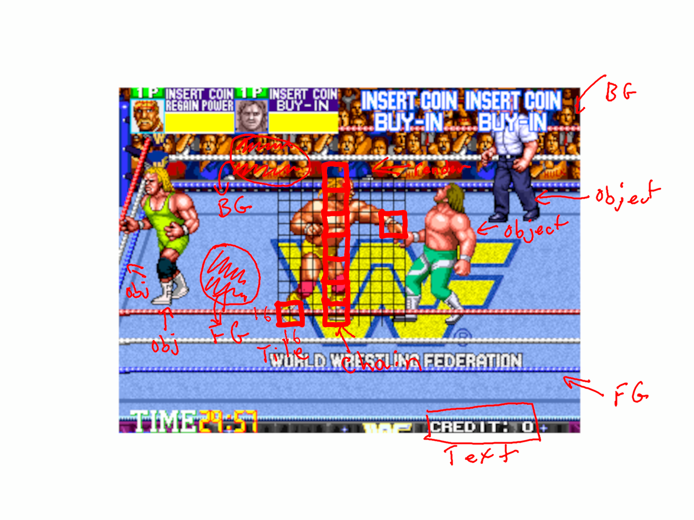

# **Technos 16-bit System**
## **Introduction**
This document is a technical overview of the Technos 16-bit system. It covers the high level architecture and subsystems of games Combatribes, Double Dragon 3 and WWF Wrestlefest. All 3 of these are slightly different boards from eachother, but the architecture is relatively the same.

### **Legal Mumbo-Jumbo**
Unfortunately, with the way everything has become now at days, I have to state that it is perfectly OK to link to this site and use materials from it ONLY if proper attribution is made. If you want to do something else with it and have any doubts, please contact us and we can answer. But please, do not be like certain people and just randomly create YouTube videos and posts without proper attribution, and always link back to the source.

## **High Level Architecture**
The Technos 16-bit system is comprised of only a single board containing all the necessary components for graphics and sound production. It has a number of custom chips, mostly having to deal with RLE decompression, buffering and graphics engine stuff.

There are 3 games in this series only, however, there are a number of changes that happened from a hardware perspective between the 3 games. the changes were mostly evolutional though, adding additional capability for the graphics engine. The rest is mostly the same.

### **Graphics Data**
The graphics data was a problem to deal with in the FPGA Core. The issue is that they had this custom chip that was responsible for transferring graphics data from the graphics rom and decompressing and assembling it back again in addition to caching stuff. They used a form of RLE compression, and they split the data into separate channels (or planes). There are a total of 4 channels, and each of the channels is located in a disparate section of the ROM and it's not contiguous at all. However, as for the rest of the system design, the wizards of Technos were highly efficient and designed a very efficient system that works well. They saved about 50% of the size by splitting and compressing the data.

Doing this sort of thing is not really efficient from an FPGA perspective. First of all, for each graphics data you pull, you would have to at least do 4 reads for each of the 4 channels of data for the object or background. Then, you would have to figure out how to assemble that and present it properly. It is more efficient to just reorder the data upfront in the decompressed and assembled format, and base the core off of that, which is what I ended up doing.

I created a python script to decrunch and repack the rom data after the MRA assembly step. It increases the size of the ROM data of course, which has to be accounted for in the loader, but it works well, and no unnecessary stuff in the core itself.

### **Rendering Engine**
The graphics for the game are produced by hardware. There is a custom chip for rendering tiles and graphics on the screen in a special coordinate system.

Combatribes and Double Dragon 3 had 3 total layers for which graphics could be presented, but Wrestlefest adds an additional text layer on top which is used for presenting text on screen.

- Foreground Layer
- Background Layer
- Sprite Layer
- Text Layer (Wrestlefest Only)

I will go through all the technicals and calculations across the layers below in detail as it is the meat of the system as a whole.

It is also important to note that all layers are double buffered in the system.

#### **Foreground Layer**
The foreground layer is also called the bg0 layer in Wrestlefest. 

- 512x512 pixel grid
- 32 tiles x 32 tiles total
- 16x16 pixel tiles each

The Foreground Layer is a 512x512 pixel grid that gets wrapped around to the active resolution, 320x240. There are 2 registers that control the positioning of the grid, `FGSCRX` and `FGSCRY`. 

At the start of the drawing process, the 2 positioning registers are latched for the pending draw operation. Then, the base of the line is calculated by taking the current y tile index, multiplying it by 16 and subtracting the latched FGSCRY value from it.

##### **Drawing Scroll Layers**
It is important to note a couple of things here. First of all, for all draw operations, we focus on drawing a single line to a line buffer. We do not draw entire frames or multiple lines at once as there is no time to do that in the interval before the next line. Secondly, for the scroll layers, we count things according to a tile grid index, and convert that to a pixel and then adjust it.

##### **Find Y Tile Index**
At the start of the draw operation, both X and Y are set to 0. We must iterate through X and Y up to 32 because there are 32 tiles across and 32 tiles down. Each tile is 16x16, so that's why we multiply by 16 when we "hop" over a tile. Finally, we subtract the FGSCRY value from the current Y pixel amount because if you have a 512x512 grid, and it has to be cropped to 320x240, what is supposed to appear on line N in the active resolution is the grid, shifted none, up or down some amount - that's what the scroll register value determines, how much the grid is supposed to be offset. A summary of the steps appears below:

- Latch the scroll X and Y values at the start of the draw line operation.
- For each value 0-32, multiply them by 16 and subtract the FGSCRY value.
- FGSCRY is always a positive value, so if FGSCRY is 0, it means the first line on the screen corresponds to 0, and the last line corresponds to 239. Lines 240 to 511 do not show. However, if the FGSCRY value is greater than 0, it means that the first line on the screen corresponds to FGSCRY and the last line on the screen corresponds to FGSCRY + 240. The grid has to be shifted up to align with the active resolution - that's why we subtract.
- Next, the post-subtracted value is is checked if it is less than -16 or not. If it is, then we add 512. The reason why is because the specification for the 512x512 grid is to wrap around itself on both axes. By adding 512, we have effectively taken the amount cut out by the scroll value and overflowed it on to the end of the 512.
- Finally, we check the calculated value to see if it is in the range of the line to be drawn from the line counter. Does the line we care about fall in the bounds of the start of this tile to the end of this tile?
- If it does not, increment Y and try again with the next tile index.

##### **Find X Tile Index**
The steps above concern finding the starting tile on the Y axis in the grid that corresponds to the line to be drawn in this line. Now, we have to do something similar to the X in that we have to apply the scroll offset first, shift the grid left or right, and then draw from there.

Again, if the calculated value is less than -16, we add 512 to the value to wrap the cut part to the end of the grid as there is a wraparound x/y specification for the layers.

Once the starting X and Y tile index is found and clipping has been applied as the above, then the starting offset of that tile can be retrieved in the Foreground VRAM.

##### **Retrieving and Applying the Metadata**
The Foreground VRAM is organized in 16 bit addressing, and each tile metadata takes up 32 bits. Therefore, the starting position would be designated by {y_tile_index, x_tile_index} * 2, as each tile takes up 32 bits.

So, knowing the address in the Foreground VRAM, you can start to retrieve the metadata of the starting tile.

From here, we have a couple of differences between Wrestlefest and The Combatribes/ DD3 boards.

The original revision of the graphics engine had only support for flips on the x-axis, but the newer board for Wrestlefest can support flips on both axes. These appear on bits 6 for x and 7 for y of the metadata.

Secondly, you have a palette id which is the lower 4 bits of the metadata, shifted left by the color depth (it is mentioned that it is 4 channels above), plus a palette offset for the layer.

Lastly, the metadata tells you the graphics rom address starting point for that particular data. A Y offset is added to this to get the particular line for that tile data.

Once all that is in place, a request is made to get the tile data from the Background Tile ROM. The graphics data are separated by their purpose, so it is easy to get the data out and put it in the line buffer.

#### **Background Layer**
The Background Layer isn't really much different than the Foreground Layer above. The same techniques still apply, but the layer does not have x or y flipping.

In addition, the metadata only takes up 16 bits as opposed to 32 bits in the Foreground Layer. It is only inclusive of a palette id and a rom offset for which to retrieve the data. At the end of the day, the data is gotten from the Background ROM and put into the line buffer.

#### **Sprite Layer**
The sprite layer is a lot more complicated than the background layers in the system.

##### **Metadata**
First of all, let's talk about the properties or metadata of a sprite. For the background layers we had the ROM address, flipping and palette id. By comparison, the sprite metadata is a lot more extensive and covers 16 bytes total. The properties include:

- Sprite X and Y position
- Palette ID
- Flip X and Y
- Chain Sequence Amount
- Enable
- Object ID

All of these properties are critical to drawing any one sprite on screen at any given time. Since it is fairly impractical to pull 16 bytes every single time a sprite needs to be drawn, what I did is setup several caches to reorganize the data in different segments.

As writes occur to the sprite RAM, what I can do is use the lower 3 bits of the address to determine what property is being changed, and direct that data to the appropriate cache.

- 2nd byte contains the MSB of the Y position in addition to the sprite chain sequence amount, MSB of the X position, enable and flip status.
- 1st byte contains the lower part of the Y position.
- 5th byte contains the palette ID.
- 6th byte contains the lower part of the X position.

All of these properties are pulled at the start of a drawing sequence in preparation.

##### **Drawing Sequence**
There can be a total of 512 sprites at any given time, and that's the amount that the memory indicates is supported. Of course, I don't think Technos ever went that far, but it was certainly possible technically to do.

Like other hardware sprite engines, each sprite is drawn on a line basis. Like the background layers, we must iterate through all the sprite indices to determine which sprites intersect the current scanline we are on - and only draw the lines of those tiles. Each tile in the system is 16x16 like the background layers. For each sprite, I check, considering the X and Y position of the sprite in addition to the size of the sprite and clipping, whether it is supposed to be drawn on this scanline or not. I also check if it is enabled according to the property metadata for the sprite cached.

Once that is determined, I pull the object ID from live Sprite VRAM (not cached), get the object offset from the Object Graphics ROM and then proceed to draw the pixels out similar to the background layer process above. Then, I increment and do the whole process over again until I reach 511 and end the cycle. Everything has to be checked to determine relevance to the current scanline.

##### **Coordinate System**
One really interesting and annoying thing about this platform is that the X and Y positioning that the game gives you in the Sprite RAM refers to a location in the bottom right hand corner of the starting tile. Normally, coordinate systems in hardware sprite games refer to the top left and extend right and down. It is the opposite here.

So, let's take a simple example here. Suppose you have a sprite you have to draw, and it says to draw it at (200,100). That's at 200 X, and 100 Y. The chain amount is 5.

What that means is the bottom right corner of the sprite is at 200,100 and extends to 100 - (5*16). In the system, things are drawn in columns from right to left instead of left to right, so the chain amount refers to a vertical chain of tiles. Each tile is 16x16 pixels. The top left starting position for the tile is in fact 200-16, 100-16.

Indeed, not common, but there are some hardware based sprite systems like this out there, but it's not as common as when the origin is in the top left corner and the coordinates are based from the top left of the tile or object. But why did they do this? It does not make life any easier for the developers, but is it efficient?

The answer is that this is a more efficient system than the conventional one. First of all, since stuff starts in the bottom right and grows to the top left, clipping sprites becomes a lot easier. This in turn reduces the calculations that have to be done to determine the actual position of the sprite and drawing the necessary tiles that make it up. Since most games scroll from left to right, it's a lot easier to calculate things, as when objects hit the left wall, no extra calculations have to be done to stop the drawing process as things are done in singular columns right to left.

Below is an illustration of these concepts overlaid on a game screen:

I have overlayed a grid on Hulk Hogan above to illustrate the concept of the tiles and vertical column chains. I have also pointed out the different things that are considered objects in this scene and what is considered background and foreground scroll layers. The side ropes move when the wrestlers go against them, so those are indeed objects (or sprites). The mat and top and bottom ropes do not move so those are scroll layers that simply pan back and forth on the 512x512 grid. The crowd also pans and scrolls, and is another grid. Finally, the text at the bottom that indicates your credits is considered a text layer. The Objects are rendered from bottom right to top left in columns, which as I indicated, is more efficient for clipping purposes.

#### **Text Layer**
One more thing I will briefly touch on is the text layer which was added for Wrestlefest. There is nothing special about this layer, except that it is a fixed grid broken up into 8x8 tile segments. There is a separate text ROM that has the graphics associated with the layer and it's 8x8 tiles.

According to the memory size, there is a maximum of 64 tiles you can have across. To render a letter, each memory address in the text VRAM indicates what character is supposed to be drawn from the ROM in that grid position. Again, it is a fixed grid. The letters must align with the grid. There is no scrolling or manipulation on this.

#### **Priority & Combination**
What was discussed above is the method by which the individual layers get rendered. However, the individual layers are apart of a whole system in which one single, combined image is displayed. There are multiple layers to this image, and there are pre-determined priorities that are adhered to when deciding which pixel of which layer should be on top of one another.

In the system, there is a register that is written to in order to determine the layer order.

Below is a list of the modes that exist in wrestlefest:

|Mode|Layer Order (backmost to frontmost)|
|-|-|
|0x7B|BG0, BG1, SPR, TEXT|
|0x7C|BG0, SPR, BG1, TEXT|
|0x78|BG1, BG0, SPR, TEXT|

And there are only 2 modes in Combatribes:

|Mode|Layer Order (backmost to frontmost)|
|-|-|
|Default|BG, FG, SPR|
|0x01|FG, SPR, BG|

Finally, there are 3 in Double Dragon 3:

|Mode|Layer Order (backmost to frontmost)|
|-|-|
|Default|BG, SPR, FG|
|0x16|BG, FG, SPR|
|0x17|FG, BG, SPR|

There are a couple more things about the graphics and rendering I would like to touch on, which are some nuances. In addition to the video register determining what the layer priority mode is as above, it also determines if either the background or foreground layers in that priority mode are transparent or not. If it's not, and it's opaque, then all pixels are drawn regardless on that layer. If it is, then only pixels that are not blank get drawn.

From a color mixer perspective, Combatribes is 4bpp, however, Double Dragon 3 is 5bpp and Wrestlefest is 4bpp. This information is essential in converting the palette color to the proper value for displaying in 8 bit RGB like we normally do.

In addition, I am not sure why this is, but for some reason I need to draw one more extra horizontal pixel in order for the entire screen to render properly or else what happens is things wrap around, and you have a junk pixel column on either side of the screen. Sometimes this is intentional as overscan, but thought I would mention it as a quirk.

### **Inputs**
The next thing I want to touch on are the inputs. Now, this game operates as a pretty normal 68k processor game with a standard setup for the address bus like other games do, but the inputs have some nuances to them.

First of all, to note, the 68k processor has a 16 bit bus that can take in or output 16 bits at a time, with a byte mask. The UDS and LDS determine what byte should be taken into account when consuming or outputting the data. So, as it happens, to save on space and routing on the board, Technos repurposed addresses for multiple uses. The use of them depends on whether the request is in byte mode (ie. only one of UDS or LDS active) or word mode (both UDS and LDS active together). So this is something you have to pay very careful attention to in wiring the input system up and make sure you don't mix up both purposes, otherwise inputs will be very screwed up and things wont work properly.

Secondly, one of the interrupts on the system is used as an input polling routine. For this, I had to measure the boards to get the proper frequency at which the interrupt triggers. I suppose you can fake it like the current emulators do, and use a fixed value for all 3 games, but technically that's not correct and if the polling is slower than it is on the real board, you may encounter latency in gameplay. It may not necessarily be noticeable by a player, but still, it adds accuracy and value to use the proper polling frequency.

Wrestlefest is 1.63Khz and Double Dragon 3 is 3.91Khz. See how much they vary? I do not have Combatribes, but since it is mostly the same as Double Dragon 3, we used the same value as Double Dragon 3.

### **Audio**
Lastly, I want to mention the audio setup used for the games. The audio setup is fairly standard and straightforward with nothing really special. Below is the hardware used:

- Z80 CPU
- MSM6295 OKI
- YM2151